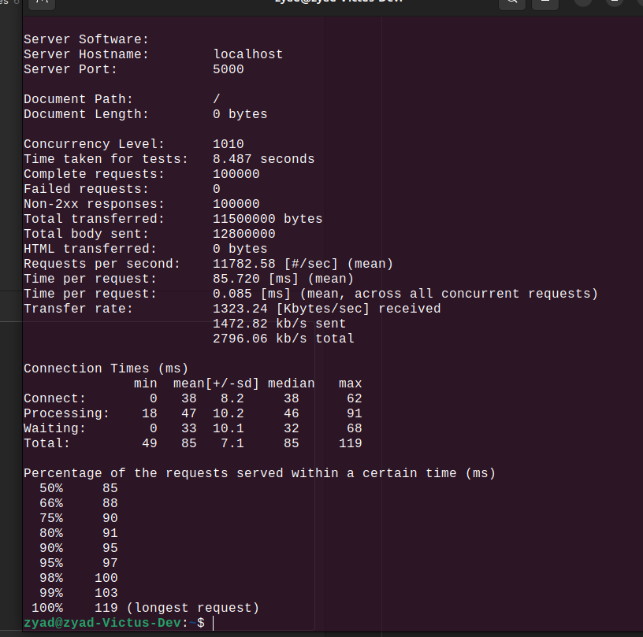

# Minimal Web Server (Serv Zy)
A lightweight, high-performance HTTP server built from scratch in C# using raw sockets. This server demonstrates core HTTP protocol implementation with async request handling, middleware pipeline support, and a clean modular architecture.

## Features

- **Raw Socket Implementation** - Built without high-level HTTP frameworks for maximum control and learning
- **Async Request Handling** - Non-blocking request processing for better performance
- **Middleware Pipeline** - Extensible middleware system for request/response processing
- **Routing System** - Simple but effective routing for different HTTP methods and paths
- **HTTP/1.1 Support** - Proper HTTP request parsing and response formatting

## Supported Endpoints

- **Can easily add whatever endpoint you want**
- **I included a simple GET endpoint and a POST endpoint for demonstration**

## Getting Started

### Prerequisites

- .NET 8.0 or later
-  Any C# development environment

### Running the Server

1. Clone the repository:
```bash
git clone https://github.com/Ozzy-ZY/Minimal-HTTP-Server-Rewrite
cd Minimal-Web-Server-Rewrite
```

2. Build the project:
```bash
dotnet build
```

3. Run the server:
```bash
dotnet run
```

The server will start on `http://localhost:5000` and display "Server started" in the console.

### Testing the Server

**GET Request:**
```bash
curl http://localhost:5000/
# Response: hello world
```

**POST Request:**
```bash
curl -X POST http://localhost:5000/ -d "Hello from POST request"
# Appends the data to data.txt file
```

## Performance



*Performance benchmarks conducted using Apache Bench (ab) showing server response times and throughput under load.*

## Architecture Highlights

### Async/Await Pattern
The server uses async/await throughout for non-blocking I/O operations, allowing it to handle multiple concurrent connections efficiently.

### Handler Abstraction
Supports both synchronous and asynchronous request handlers through a clean interface hierarchy:
- `IHttpHandler` - Base interface
- `IAsyncHandler` - For async operations
- `ISyncHandler` - For synchronous operations

### Middleware Pipeline
Extensible middleware system allows for cross-cutting concerns like logging, authentication, and response modification.

### Builder Pattern
The `HttpResponse.ResponseBuilder` class provides a fluent API for constructing HTTP responses.

## Extending the Server

### Adding New Handlers
```csharp
public class CustomHandler : IAsyncHandler
{
    public async Task<HttpResponse> HandleRequestAsync(HttpRequest request, Socket socket)
    {
        // Your handler logic here
        return new HttpResponse.ResponseBuilder()
            .WithStatusCode(HttpStatusCode.Ok)
            .WithStringBody("Custom response")
            .Build();
    }
}
```

### Adding New Middleware
```csharp
public class CustomMiddleware : IResponseMiddleware
{
    public Task ProcessAsync(HttpRequest request, ref HttpResponse response, ref LinkedListNode<IResponseMiddleware>? next)
    {
        // Your middleware logic here
        return Task.CompletedTask;
    }
}
```

### Registering Routes and Middleware
```csharp
// In Server.cs Main method
router.AddRoute(HttpMethod.Get, "/custom", new CustomHandler());
pipeline.Use(new CustomMiddleware());
```

## Learning Outcomes

This project demonstrates:
- Raw socket programming in .NET
- HTTP protocol implementation
- Async/await patterns for I/O operations
- Middleware implementation
- Builder and factory patterns

## License

This project is open source and available under the [MIT License](LICENSE).

## Contributing

Feel free to fork this project and submit pull requests for improvements. This is a learning project, so educational enhancements are especially welcome!